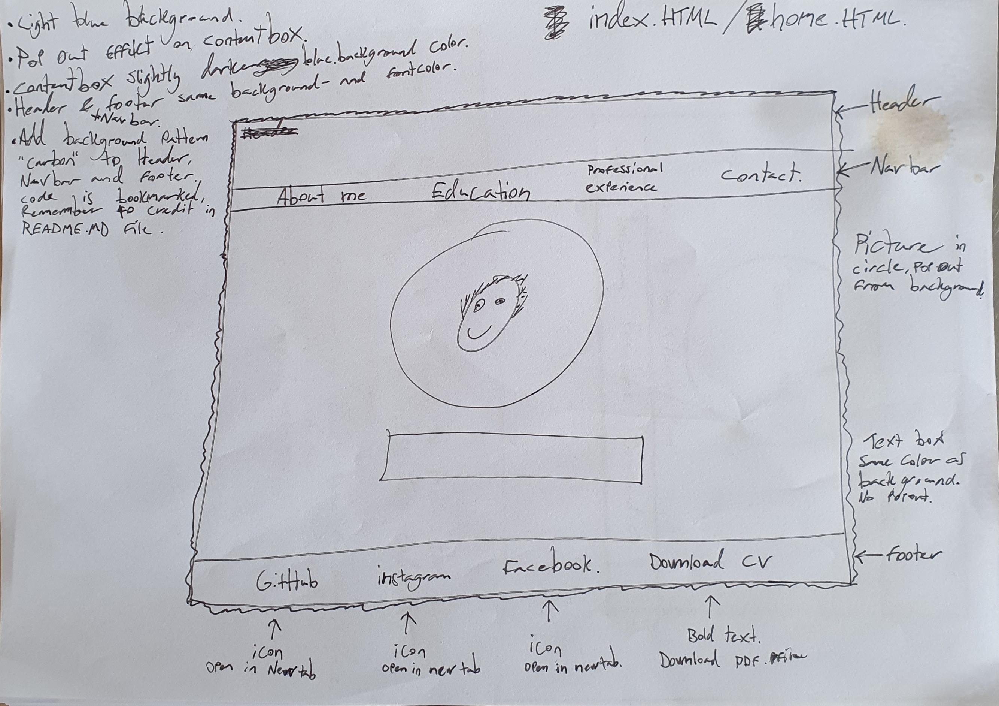
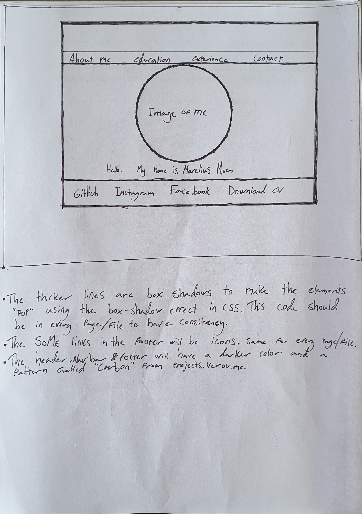
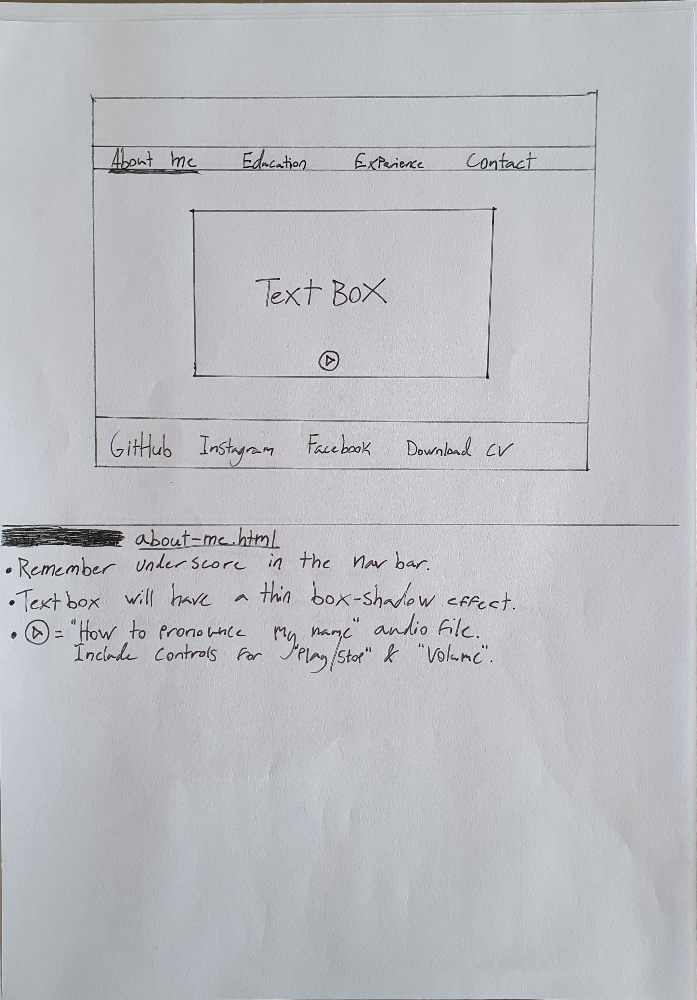
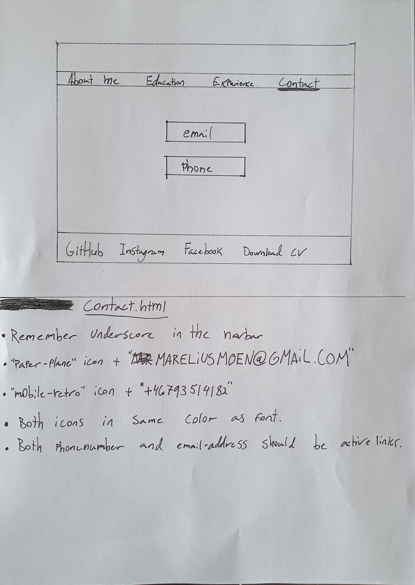
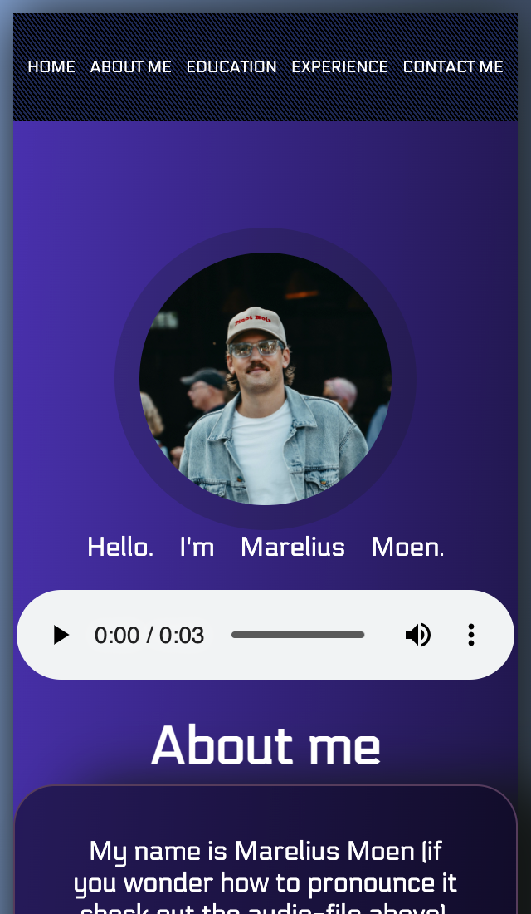
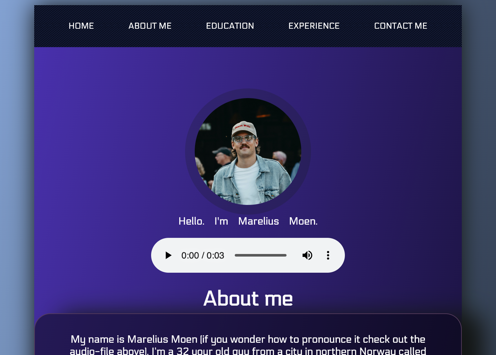

# Marelius Moen's Online CV
-----
This is the online CV for Marelius Moen and this project is made to increase my personal visibility online, to be a landingsite for potential employer, collaberators and collegues. It will serve as a more professional display compared to the personal Instagram and and Facebook accounts that is used to show what I do on my own time, both of these accounts have a link in the footer and they will continue to be used for private content about my everyday life with friends and family.

# Initial design-plans

These are the initial plans and the design sketches for this site:

And then some more refined design and structure:

-----
index.html sketch

-----
about-me.html sketch

-----
contact.html

 
-----
# Design changes early in the process
Struggled with achieving a uniform style and size when I had multiple pages, so I decided that it would be better for the UI to have 5 sections that were responsive to different screen-sizes instead.
The colors where also changed to a darker purple combination that gave a more professional feel.
-----

# Features 
The page will be quick glimpse in to Marelius Moens work experiences, education & certificates and an easy way to get in touch or send business propositions. 

- The site features a responsive navigation bar that takes you to the different sections of the site, and the navigation bar will follow you on your journey while you’re scrolling further down the page.

- There’s a picture of Marelius Moen himself, with a descriptive alt text for accessibility. There is also an audio player with controls that let you hear how to pronounce the name before an eventual meeting/phonecall.

- The “About me” section contain a paragraph that in a playful way tells you some background story to why Marelius has the values and work-ethic that he puts pride in today. This paragraph does not explain to much, but makes you curios to know more.

- The “Education” section is a short list that precisely informs you about the courses, school and certifications he has completed/attends now, and it also tells the user where in the world he did it. This list is responsive and will show in the same order but fit to smaller screen sizes.

- The “Work experience” section is a short list that precisely informs you about the positions, workplaces and timeperiod he worked there, and it also tells the user where in the world he did it. This list is responsive and will show in the same order but fit to smaller screen sizes.

- The “Contact” section has a Get in touch header and 2 active direct link-icons for email (represented by a paperplane icon) and phonecall (represented by an old-school mobile phone icon). 
-The second part of the “Contact” section is a contact form, with required inputs for: First Name, Last Name, Email (Email input value), and a subject text.

- The footer at the bottom of the site contains active link icons for Marelius Moens GitHub profile, Instagram profile, Facebook profile and a download link to download his CV/resume in a traditional layout PDF-file.

# Screenshots of different screensizes

## Mobile

## Tablet

## Laptop

## 4k desktop

# Features left to implement
- When uploaded to a server, make the contact-form operational.

# Problems encountered and the fix
- Struggled with achieving a uniform style and size when I had multiple pages, so I decided that it would be better for the UI to have 5 sections that were responsive to different screen-sizes instead.
- The inital color scheme I imagined for the project didn’t go well together, so with I decided to go more towards a dark-purple and black color scheme for a more proffessional look.
- The image was turning egg-shaped when I added the border-radius styling, the solution was to have the image file being completely square.
- Struggled with the positioning of the sections and then within the sections the content, had to redo the whole positioning with flex-styling and adding/removing divs where needed.
- Getting the header background to be the right size and responsive to different screen sizes, had to change width from px to %.

# Deployment and how it was deployed
This site was deployed to GitHub Pages and this is the method I used:
From the GitHub repository go to the settings, in the source-section dropdown menu select master branch.
Once the master branch has been selected, the page will be automatically refreshed with a detailed ribbon display to indicate the successful deployment.

# Credits, content/media

## Content
- The main background effect & background pattern on the header and footer where inspired by the guide at codepen.io.
- The box-shadow styling I found at developer.mozilla.org.
- All the icons are free from fontawesome.com.
- Contact-form and how to change the placeholder-text-color is inspired by the code found in the w3school guide to creating a form with html/css.

## Media
- Picture taken by Anna Marxen at Deilig Media, used on this website with her permission.